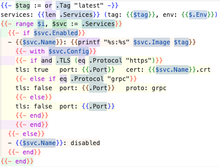

# Colorful Go Template — Rainbow Highlighter

> Go template rainbow backgrounds, variable spotting, and `{{ }}` injection into any host language.

## What it does



- **Rainbow backgrounds** — each nesting level (`if`/`range`/`with`/`define`) gets a distinct background color, rotating through 6 levels.
- **Variable spotting** — `$x :=` definitions glow green, `$x =` assignments glow orange, `$x` uses glow blue.
- **TextMate grammar** — foreground scope coloring in diff/peek views.
- **Semantic tokens** — variable definitions vs. uses are classified so themes can style them.
- **Injection grammar** — `{{ }}` actions are highlighted and rainbow-decorated inside any supported host language without losing that language's own syntax coloring.

## Which language mode to choose

| File type | Language mode to set | Why |
|---|---|---|
| Pure Go template (`.gotmpl`, `.gohtml`, etc.) | **Colorful Go Template** | The file IS the template; no base syntax to preserve. |
| Template wrapping CMake, SQL, YAML, … | **Keep the base language** (`cmake`, `sql`, `yaml`, …) | The injection grammar adds `{{ }}` scopes on top; the decorator runs automatically. |

For the second case, add specific patterns to `files.associations` so VS Code picks the right language. More specific globs win over less specific ones:

```jsonc
// .vscode/settings.json or user settings
"files.associations": {
  // pure templates → colorful-tmpl
  "*.gotmpl":            "colorful-tmpl",
  "*.gohtml":            "colorful-tmpl",
  // mixed templates → base language (more specific patterns take priority)
  "CMakeLists.*.tmpl":   "cmake",
  "*.cmake.tmpl":        "cmake",
  "*.yaml.tmpl":         "yaml",
  "*.sql.tmpl":          "sql",
  "*.sh.tmpl":           "shellscript",
  "*.py.tmpl":           "python",
  // fallback for any remaining .tmpl
  "*.tmpl":              "colorful-tmpl"
}
```

## Automatic injection languages

The extension injects `{{ }}` syntax scopes and applies rainbow backgrounds automatically when the file language is one of:

`yaml` · `json` · `html` · `xml` · `markdown` · `cmake` · `sql` · `python` · `shellscript` · `toml` · `ruby` · `go` · `nginx`

For any other language, add it to `colorful-tmpl.rainbow.additionalLanguages`.

## Settings

| Key | Default | Description |
|---|---|---|
| `colorful-tmpl.rainbow.enabled` | `true` | Enable/disable all rainbow backgrounds. |
| `colorful-tmpl.rainbow.palette` | 6 rgba colors | Background colors per nesting level (rotates). |
| `colorful-tmpl.rainbow.additionalLanguages` | `[]` | Extra language IDs to apply rainbow decorations to, beyond the built-in injection list. |

## Packages

| Package | Description |
|---|---|
| `@colorful-tmpl/highlight-core` | Editor-agnostic Go template lexer with nesting tracking |
| `colorful-tmpl` (VS Code) | Grammars + rainbow decorator extension |

## Installation

The extension is not yet published to the VS Code Marketplace. Install directly from source:

```bash
git clone https://github.com/d-led/colorful-trees-forest.git
cd colorful-trees-forest
npm install
scripts/install-here.sh
```

`install-here.sh` builds the core and extension, packages a `.vsix`, and installs it into whichever VS Code window ran the command. Reload the window (`Developer: Reload Window`) to activate.

To uninstall: `scripts/install-here.sh --uninstall`

## Development

```bash
npm install
npm test                        # run all tests
npm run build                   # build core + extension
scripts/install-here.sh         # build, package and install into current editor
scripts/analyze.ts.sh           # run refactoring metrics lint
```

## License

MPL-2.0
