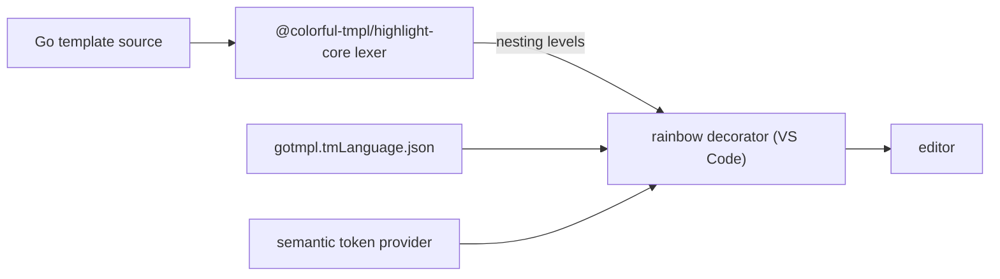

# Colorful tmpl — rainbow highlighting for Go templates

Rainbow nesting backgrounds, variable spotting, and `{{ }}` injection into any
host language.


## What it does

- **Rainbow backgrounds** — each nesting level (`if` / `range` / `with` / `define`) gets a distinct background color, rotating through 6 levels.
- **Variable spotting** — `$x :=` definitions glow green, `$x =` assignments glow orange, `$x` uses glow blue.
- **TextMate grammar** — foreground scope coloring in diff/peek views.
- **Semantic tokens** — variable definitions vs. uses are classified so themes can style them.
- **Injection grammar** — `{{ }}` actions are highlighted and rainbow-decorated inside any host language without losing that language's own syntax coloring.

## How it works



## Choosing a language mode

| File type | Language mode to set | Why |
|---|---|---|
| Pure Go template (`.gotmpl`, `.gohtml`, …) | **Colorful Go Template** | The file IS the template; no base syntax to preserve. |
| Template wrapping CMake, SQL, YAML, … | **Keep the base language** (`cmake`, `sql`, `yaml`, …) | The injection grammar adds `{{ }}` scopes on top; the decorator runs automatically. |

For mixed templates, add patterns to `files.associations` — more specific globs win:

```jsonc
// .vscode/settings.json or user settings
"files.associations": {
  // pure templates → colorful-tmpl
  "*.gotmpl": "colorful-tmpl",
  "*.gohtml": "colorful-tmpl",
  // mixed templates → base language (more specific patterns take priority)
  "CMakeLists.*.tmpl": "cmake",
  "*.cmake.tmpl": "cmake",
  "*.yaml.tmpl": "yaml",
  "*.sql.tmpl": "sql",
  "*.sh.tmpl": "shellscript",
  "*.py.tmpl": "python",
  "*.java.tmpl": "java",
  // fallback for any remaining .tmpl
  "*.tmpl": "colorful-tmpl"
}
```

## Settings

| Key | Default | Description |
|---|---|---|
| `colorful-tmpl.rainbow.enabled` | `true` | Enable/disable all rainbow backgrounds. |
| `colorful-tmpl.rainbow.palette` | 6 rgba colors | Background colors per nesting level (rotates). |
| `colorful-tmpl.rainbow.variableHighlight` | `true` | Enable/disable the variable spotting highlights. |
| `colorful-tmpl.rainbow.variableDefColor` | theme green | Background color for `$x :=` definitions. |
| `colorful-tmpl.rainbow.variableAssignColor` | theme orange | Background color for `$x =` assignments. |
| `colorful-tmpl.rainbow.variableUseColor` | theme blue | Background color for `$x` uses. |

## Installation

Install from the VS Code Marketplace: `ext install d-led.colorful-tmpl`.

## License

[MPL-2.0](LICENSE)
